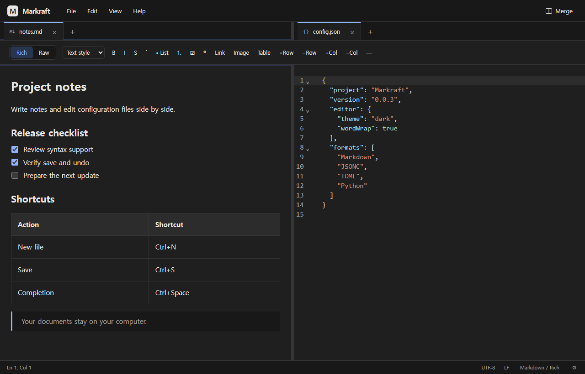

<p align="center">
  
</p>

<h1 align="center">Markraft</h1>

<p align="center">A desktop editor for Markdown, text, and structured files.</p>

<p align="center">
  <strong>Markdown</strong> · <strong>Text & logs</strong> · <strong>Configuration & code</strong><br>
  English · 한국어 · 日本語
</p>

<p align="center">
  <a href="#get-started">Get started</a> ·
  <a href="#editing">Editing</a> ·
  <a href="#keyboard-shortcuts">Shortcuts</a> ·
  <a href="#development">Development</a> ·
  <a href="#license">MIT License</a>
</p>



## Editing

Write directly in a Markdown document, switch to its source, or keep a configuration file beside your notes.

| Format | Editor |
| :--- | :--- |
| **Markdown** · `.md`, `.markdown` | Rich editing with headings, lists, tasks, tables, links, and images. Switch to **Raw** to edit the source. |
| **JSON / JSONC** · `.json`, `.jsonc` | Syntax colors and syntax diagnostics. JSONC allows comments and trailing commas. |
| **YAML / XML** · `.yaml`, `.yml`, `.xml` | Syntax colors, folding, and indentation. |
| **Text** · `.txt` | Plain-text editing, search and replace, line navigation, and multiple cursors. |

All source editors use colors matched to the light or dark theme. Markdown prose and code have separate font settings.

Also available: **TOML, INI, .env, CSV, TSV, HTML, CSS, SQL, JavaScript/JSX,
TypeScript/TSX, Python, Shell/Bash and PowerShell**. Grammars load on demand.
Create an extensionless document with **New file** or **+**, then click the syntax
name in the status bar to search and select a language. File names normally
determine syntax automatically; manual choices stay with the open tab. Save
dialogs offer the registered formats plus All files. See [syntax support](SYNTAX_SUPPORT.md)
for detection rules and language-specific capabilities.

File names appear in tabs. Ordinary files have no extra document toolbar;
Markdown shows only its Rich/Raw switch and, in Rich mode, formatting tools.
Save through **File → Save** or **Ctrl+S**.

Plain text, logs and Markdown Raw stay quiet while typing. Use **Edit → Complete**
or **Ctrl+Space** to request suggestions, including words from the current document.
Code syntaxes retain automatic language-provided suggestions such as HTML tags,
CSS properties and SQL keywords; document-word suggestions are manual in all syntaxes.
Select with the arrow keys, then accept with **Enter** or **Tab**; **Escape** closes
the list. No candidate is selected automatically, so ordinary Enter and Tab keep
their newline/indent behavior. Bracket and quote pairs close automatically.
These features work locally in source editors (including Markdown Raw mode);
they do not use AI or a language server.

### Arrange your workspace

- **Reorder:** drag a tab along the tab bar.
- **Split:** drag a tab to the left or right edge of the editor, then drop it on the preview.
- **Move between panes:** drop a tab into the other pane or its tab bar.
- **Resize:** drag the divider; double-click it to restore equal widths.
- **Merge:** choose **Merge**, or close/move the last document out of either pane.

Moving tabs keeps each editor's text and undo history. Each pane selects its own document; editing and saving apply to the focused one.

### Choose your language

The interface follows your system's preferred supported language on first launch. Choose **English**, **한국어**, **日本語**, or **System** under **View → Settings → Language**. An explicit choice is remembered across restarts; unsupported system languages fall back to English.

Menus, dialogs, search controls, tooltips, and application messages change without reopening documents. Native Windows dialogs and operating-system error details use the OS language.

## Get started

Download **[Markraft 0.0.3](https://github.com/Hinen/Markraft/releases/tag/v0.0.3)**:

| Platform | Download |
| :--- | :--- |
| Windows x64 | [Windows installer](https://github.com/Hinen/Markraft/releases/download/v0.0.3/Markraft_0.0.3_windows_x64_setup.exe) |
| macOS — Apple Silicon & Intel | [Universal DMG](https://github.com/Hinen/Markraft/releases/download/v0.0.3/Markraft_0.0.3_macos_universal.dmg) |

Run the Windows installer, or open the DMG and drag Markraft to Applications. Then open a file with **Ctrl+O**, or drop files into the window. The Windows installer is unsigned; the macOS application is ad-hoc signed and not notarized, so the OS may request approval when opening it.

Installing or upgrading Markraft registers **48 extensions** as Windows **Open with**
candidates: syntax-supported formats plus common text files such as `.log`, `.conf`
and `.config`. This does not change your default editor. Unknown text extensions
can still be opened from Markraft or by selecting its executable in Windows' app
picker. Running the development app does not register file associations.

Release installers are built by the [release workflow](.github/workflows/release.yml). Checksums are attached to the release.

To run from source, see [Development](#development).

## File handling

Saving JSON does not reformat it or convert large integers. Rich Markdown editing preserves untouched source blocks; structural edits may normalize the block being changed.

| Behavior | Details |
| :--- | :--- |
| Encodings | UTF-8, UTF-8 BOM, and BOM-marked UTF-16 LE/BE. |
| Line endings | Existing LF/CRLF and final newlines are preserved. New files use UTF-8 / CRLF. Mixed endings become the detected style after editing. |
| Unchanged files | Saving without changes preserves file bytes and modification time. |
| External edits | Clean documents reload; modified documents ask you to reload or keep your edits. |
| Missing files | **Save As** lets you keep a copy. |
| Closing | Modified files ask for Save / Discard / Cancel. Canceling **Close all** keeps the tabs open. |

<details>
<summary><strong>Markdown, images, and current limits</strong></summary>

- Rich mode supports CommonMark and GFM. Use Raw for frontmatter, math, or custom Markdown extensions. Raw HTML is shown as text rather than executed.
- Ordinary text, table-cell, and checkbox edits preserve surrounding Markdown. Structural changes can normalize the edited block. If source/meaning preservation fails, saving is blocked and the edit remains available in Raw for review.
- Rich search matches within a text node. Use Raw for replace, line navigation, or searches across formatting boundaries.
- Raw and Rich have separate undo histories. Tabs preserve those histories, but switching modes is not a shared undo timeline.
- Remote HTTPS images load only when you choose **Load once**. Relative PNG/JPEG/GIF/WebP images must be inside the document folder and no larger than 20 MB.
- Files larger than 100 MB are rejected. Large Markdown documents offer a Raw-mode alternative.
- Session restoration, crash recovery, and automatic updates are not implemented. Save edits before closing or terminating the app.

</details>

## Keyboard shortcuts

Use **Command** in place of **Ctrl** on macOS where supported.

| Action | Shortcut |
| :--- | :--- |
| New file | `Ctrl+N` |
| Open | `Ctrl+O` |
| Save / Save As | `Ctrl+S` / `Ctrl+Shift+S` |
| Close tab / Close all | `Ctrl+W` / `Ctrl+Shift+W` |
| Undo / Redo | `Ctrl+Z` / `Ctrl+Y` or `Ctrl+Shift+Z` |
| Find / Replace / Go to line | `Ctrl+F` / `Ctrl+H` / `Ctrl+G` |
| Request completion in a source editor | `Ctrl+Space` |
| Select / Accept / Dismiss a completion | `↑` / `↓`, then `Enter` or `Tab`; `Esc` to dismiss |
| Switch Rich ↔ Raw | `Ctrl+Shift+M` |
| Bold / Italic in Rich | `Ctrl+B` / `Ctrl+I` |
| Next / Previous tab in a pane | `Ctrl+Tab` / `Ctrl+Shift+Tab` |
| Move a focused tab | `Alt+Shift+←` / `Alt+Shift+→` |
| Multiple cursors in Raw | `Alt+click`; `Ctrl+D` selects the next match |
| Next / Previous table cell | `Tab` / `Shift+Tab` |

Middle-click a tab to close it. Use the mouse wheel to scroll an overflowing tab bar.

## Development

**Stack:** Tauri 2 · Rust · React · TypeScript · CodeMirror 6 · Milkdown / ProseMirror

Requirements: Node.js 22.12+ (24 recommended), npm, stable Rust, and the platform's Tauri build tools. On Windows, install Visual Studio Build Tools with **Desktop development with C++**, the Windows SDK, and WebView2. macOS builds require Xcode Command Line Tools.

```sh
npm ci
npm run tauri dev
```

`npm run dev` starts the frontend development server. Native file operations require the Tauri process.

<details>
<summary><strong>Build installers</strong></summary>

```sh
# Run on Windows x64
npm run tauri build -- --bundles nsis
# Output: src-tauri/target/release/bundle/nsis/

# Run on macOS
npm run tauri build -- --bundles app
# Output: src-tauri/target/release/bundle/macos/
```

Verify a Windows installation, using its actual installation directory:

```powershell
./scripts/verify-windows-install.ps1 -InstallDirectory "$env:LOCALAPPDATA\Markraft"
```

</details>

<details>
<summary><strong>Run checks</strong></summary>

```sh
npm run build
npm test
npx playwright install chromium
npm run test:e2e
cargo test --locked --manifest-path src-tauri/Cargo.toml
cargo clippy --locked --manifest-path src-tauri/Cargo.toml --all-targets -- -D warnings
npm audit
npm run licenses
```

Playwright uses a file-bridge test double. Rust tests cover real file encoding and writes; installed-app checks are recorded separately. Automated string input is not evidence of Windows IME composition behavior.

</details>

### Project map

```text
src/
  app/          Menus, dialogs, and application actions
  editors/      Rich and source editors
  files/        File types and native bridge
  i18n/         English, Korean, and Japanese messages
  settings/     Persisted preferences
  tabs/         Tabs and split panes
src-tauri/src/  File access, encoding, atomic writes, OS integration
tests/         Unit tests, Markdown fixtures, and UI regression checks
```

### Verification and dependencies

The [0.0.3 release run](https://github.com/Hinen/Markraft/actions/runs/35692787796)
passed on Windows and macOS: 148 unit tests per platform, 82 Windows browser E2E
scenarios, Rust checks, Windows installation/association checks, and macOS universal
architecture, signature, DMG and startup checks. Browser scenarios use a file-bridge
test double; they are not native desktop UI tests. Windows 10, interactive macOS
editing, actual Windows IME composition and Explorer default-app selection still
need verification. See [QA.md](QA.md) and [regression notes](QA_REGRESSIONS.md) for
current coverage and historical installed-app checks.

## License

Markraft is licensed under the **[MIT License](LICENSE)**.
You may use, modify, and redistribute it, including commercially, while retaining
the copyright and license notice. The software is provided without warranty.

Third-party components retain their own licenses. See the
[dependency inventory](DEPENDENCIES.md), [upstream notices](THIRD_PARTY_NOTICES.txt),
and [dependency review and source links](DEPENDENCY_REVIEW.md).

## Code signing policy

See the [Code signing policy](CODE_SIGNING_POLICY.md) for maintainers, release
approval, and signing status, and the [Privacy policy](PRIVACY.md) for data handling.
SignPath has not been applied for or enabled. Existing Windows releases remain
unsigned; macOS releases are ad-hoc signed and not notarized.

### Installation and removal

The Windows installer writes the application to its installation directory, creates
uninstall registration and shortcuts as selected in setup, and registers supported
file types in **Open with**. It does not choose Markraft as your default editor.
If WebView2 is missing, setup may download and install it from Microsoft.
Uninstall Markraft through **Settings → Apps → Installed apps**. Documents you saved
are not application files and should be kept or removed separately; application
preferences or platform runtime data may remain after uninstalling.

On macOS, drag the application from the DMG to Applications. To uninstall, quit it
and move Markraft.app to Trash. Documents and application preference/WebView data
are separate from the app bundle. See the [Privacy policy](PRIVACY.md) for platform
and network details.
